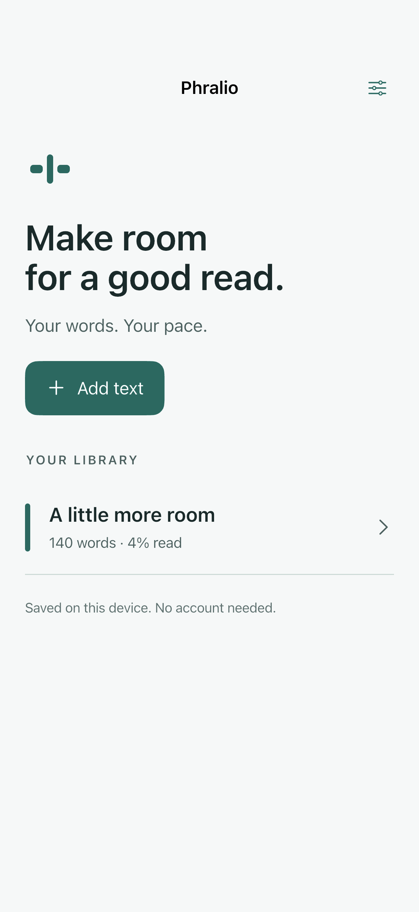
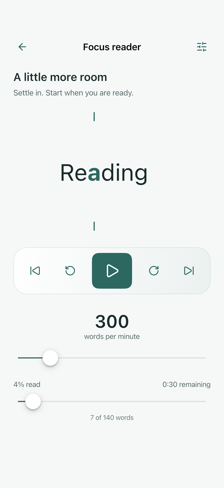
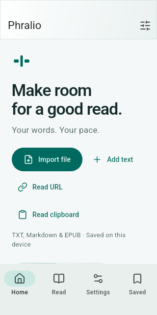
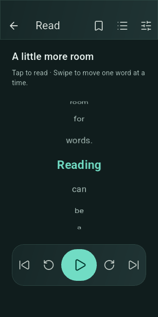

<p align="left"></p>

An offline-first reading app that gives each word a stable point of attention.
Built with Flutter for iOS and Android, with native navigation and controls.

Phralio presents text one word at a time using RSVP (rapid serial visual
presentation). Its focal character stays in one measured position as words
change. Pace and punctuation pauses are controls for personal comfort, not
promises of faster comprehension.

**Status: local reader with optional URL import.** TXT, Markdown and DRM-free EPUB
importing, stars, bookmarks, contents, saved positions and light/dark themes are implemented.
Conventional page reading, PDF reflow and purchasing remain later milestones.

  

 

### Read now

- Use Home, Read, Settings and Saved tabs. Read resumes the most recent reading;
  Saved holds bookmarks and starred readings.
- Import TXT, Markdown or DRM-free EPUB; paste text, read the clipboard, save a
  public HTTPS text/article URL, or try the original sample reading.
- Browse recent readings or starred favorites; see progress across the whole file.
- Jump to EPUB or Markdown headings through Contents; bookmark individual words.
- Importing identical text again resumes its saved place instead of adding a copy.
- Play, pause, resume, jump ten words, move between sentences or scrub position.
- Tap the reading surface to play with controls hidden; tap again to pause and
  browse the words before and after. The paused wheel advances one word per step.
- View supported PNG/JPEG/GIF/WebP images from EPUB, Markdown or articles. Image
  frames use a separate 1–30 second viewing-time setting.
- Adjust 100–1500 WPM live; choose Off, Normal or Strong smart pauses.
- Keep the focal glyph anchored using real text measurement, including composed
  Unicode characters; adjust type size or turn highlighting off.
- Restore document position and settings from local SQLite. Reopening starts paused.
- Choose System, Light or Dark appearance, saved across restarts.
- Follow the device language or choose English, Russian, Spanish, Portuguese,
  Simplified Chinese, Japanese, Polish, German, French or Italian in Settings.
  The choice is saved on this device.
- Lucide icons, native UIKit Liquid Glass controls and menus on iOS 26+, with
  accessible older-iOS and Android fallbacks. Reduce transparency for solid surfaces.
- A calm continuation card, floating navigation, grouped settings and focused
  preference sheets. [DESIGN.md](DESIGN.md) defines the redesign rules.

No account or content upload. Imported text and images stay on the device; OS backup behavior
still applies. Optional Umami usage statistics are off by default and only
available in builds configured with an Umami property. They include screen visits
and fixed app actions, never book text, titles, filenames or reading positions.
Paste limit: 200,000 UTF-16 code units. File import: 32 MB source,
64 MB total EPUB expansion, 16 MB per text resource, 2 million text code units.
EPUB imports the main reading order with headings and supported embedded images;
original layout and DRM are unsupported. Markdown can load data-URI and public
HTTPS images; relative images beside a picked file may be unavailable due to
mobile file-picker access. URL import removes scripts, navigation and forms,
downloads supported same-site images, and requires a network connection at
import time. Pages/images are bounded to 4 MB/2 MB, with 24 images and 16 MB
total image data per reading. TXT accepts UTF-8 or BOM-marked UTF-16. Tokenization
is whitespace-based; specialized CJK segmentation is not yet provided.

### Run and test

New to Flutter? Start with the [step-by-step emulator and testing guide](docs/development/quickstart.md).

Use Flutter 3.47.5 stable / Dart 3.13.4 or a compatible newer stable SDK.
Install Xcode for iOS or Android Studio/SDK with an emulator for Android.

```sh
flutter pub get
flutter run
dart format --output=none --set-exit-if-changed lib test integration_test test_driver
flutter analyze
flutter test
flutter test integration_test -d <device-id>
```

See [environment](docs/development/environment.md) and
[validation](docs/development/validation.md) for the actual development setup,
executed checks and remaining release work. GitHub Actions validates formatting,
analysis and tests without privileged secrets. CI execution requires a push.

To enable optional Umami tracking in a build, create a dedicated Umami website
property and supply its HTTPS server URL, website UUID and app hostname:

```sh
flutter run -d <device-id> \
  --dart-define=UMAMI_URL=https://stats.example.org \
  --dart-define=UMAMI_WEBSITE_ID=12345678-1234-1234-1234-123456789abc \
  --dart-define=UMAMI_HOSTNAME=app.example.org
```

Replace all example values with your own. The hostname should match the hostname
configured for that Umami property. In the app, open **Reading settings → Share
usage statistics** to opt in. Builds without these values leave the switch
disabled and send nothing. Analytics delivery is best effort: offline events are
dropped, reading never waits for the server, and opting out stops future sends.

Screenshots use synthetic text and the actual native app renderer. Regenerate:

```sh
flutter drive --driver=test_driver/screenshots.dart --target=integration_test/screenshots_test.dart -d <device-id>
```

### Architecture

Pure Dart tokenization, settings and a monotonic playback engine live in `core`.
Feature folders own library storage, reader UI and premium contracts. Riverpod
injects the SQLite store and capabilities. Narrow stream listeners update the
word and progress surfaces. [Architecture and invariants](docs/development/architecture.md).
Flutter generates typed UI strings from ten ARB catalogs in `lib/l10n`;
`flutter pub get` regenerates the ignored Dart localization files.

The public app builds by itself. The private Pro repository may consume the
public package and supply entitlement/PDF implementations through composition;
public code never imports private source. This milestone contains safe free
contracts, not a working commercial parser or payment system.

### Identity and licensing

Phralio was selected after [preliminary public naming research](docs/brand/naming-research.md).
No material conflicting software use was found in the reviewed sources; this is
not formal legal clearance. Similar-mark findings and search limitations are
recorded. [Brand concepts](docs/brand/brand-concepts.md) and
[brand guide](docs/brand/brand-guide.md) document the original identity.

- Software code: [Mozilla Public License 2.0](LICENSE).
- Third-party components: their [respective licenses](THIRD_PARTY_NOTICES.md).
- Name, logo and product identity: separate [branding terms](TRADEMARKS.md).
- Legal owner is deliberately a centralized placeholder pending owner selection.

Outside contributions and support requests are not currently accepted; see
[CONTRIBUTING](CONTRIBUTING.md). No CLA is required or provided.
[Security/privacy](SECURITY.md) · [Roadmap](docs/development/roadmap.md).

## Approved visual identity

The app implements **The reading aperture** from the workspace's approved
`phralio-brandkit`: Paper/Ink surfaces, Brick/Ember actions, exact split-P SVGs,
IBM Plex Sans UI/reader type and selective Newsreader library headings.
The fonts ship locally with OFL licenses available in Open-source licenses.
Native iOS glass controls receive the same palette through the existing bridge.
See [DESIGN.md](DESIGN.md) and [artwork tooling](assets/brand/README.md).
