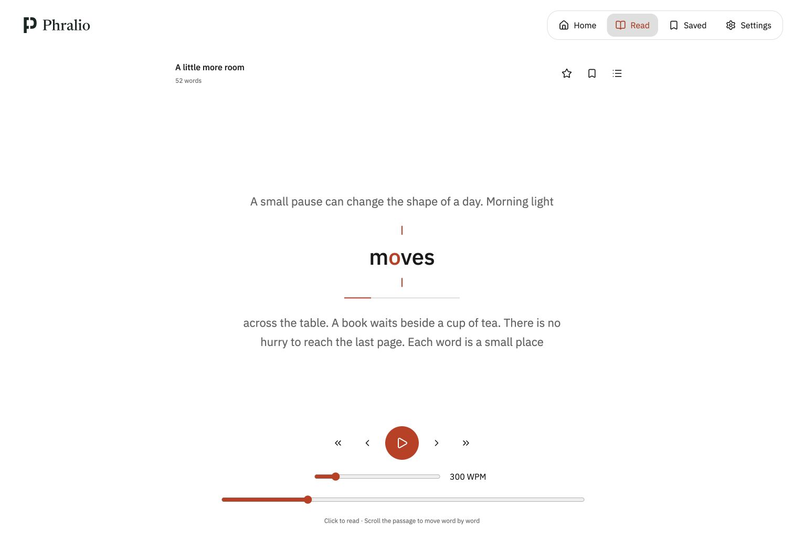
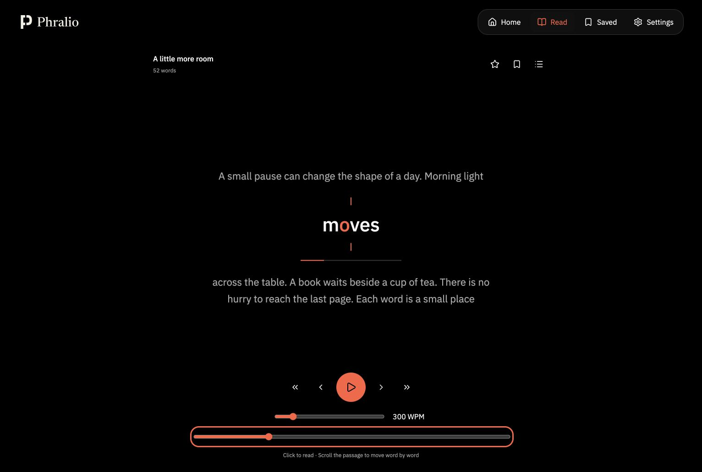
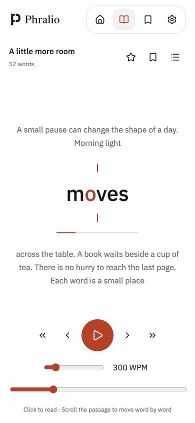

# Browser screenshots

Captured 2026-09-29 with synthetic text only.

- `chrome-installed-reader.png`: actual unpacked Phralio extension in Chrome Beta,
  including browser chrome; Light theme and saved 240 WPM.
- `preview-reader-dark.png`, `preview-reader-light.png`: the built UI in Chrome's
  local API preview, normal desktop viewport. These are visual evidence, not
  extension-permission evidence.
- `preview-reader-narrow.png`, `preview-focus-narrow.png`: 390×844 UI preview.
- `preview-reader-landscape.png`: 844×390 UI preview.

After the focal-anchor fix:
- `preview-settings-spacing-light.png`: rebuilt local UI preview in the in-app
  Chromium browser, showing padded native select controls.
- `preview-focal-anchor-light.png`: same preview, focal letter centered between
  both scope marks. These supersede the older screenshots for anchor behavior.
