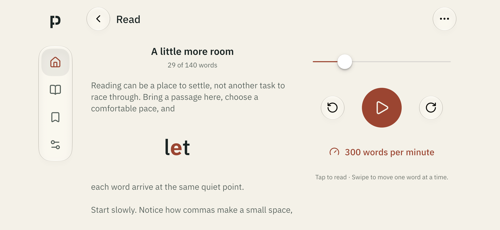
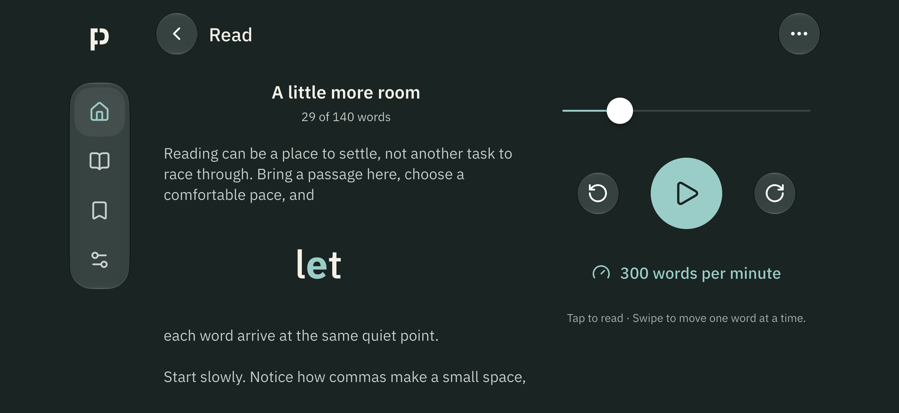
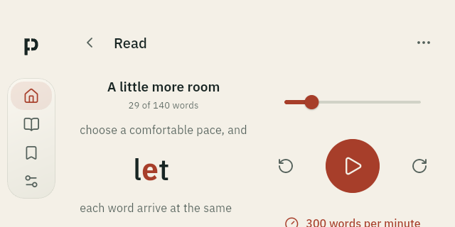
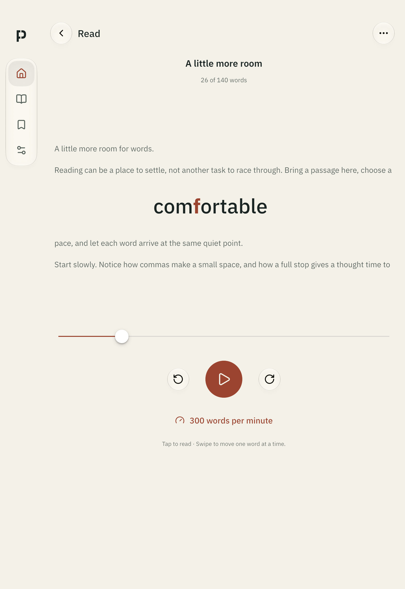
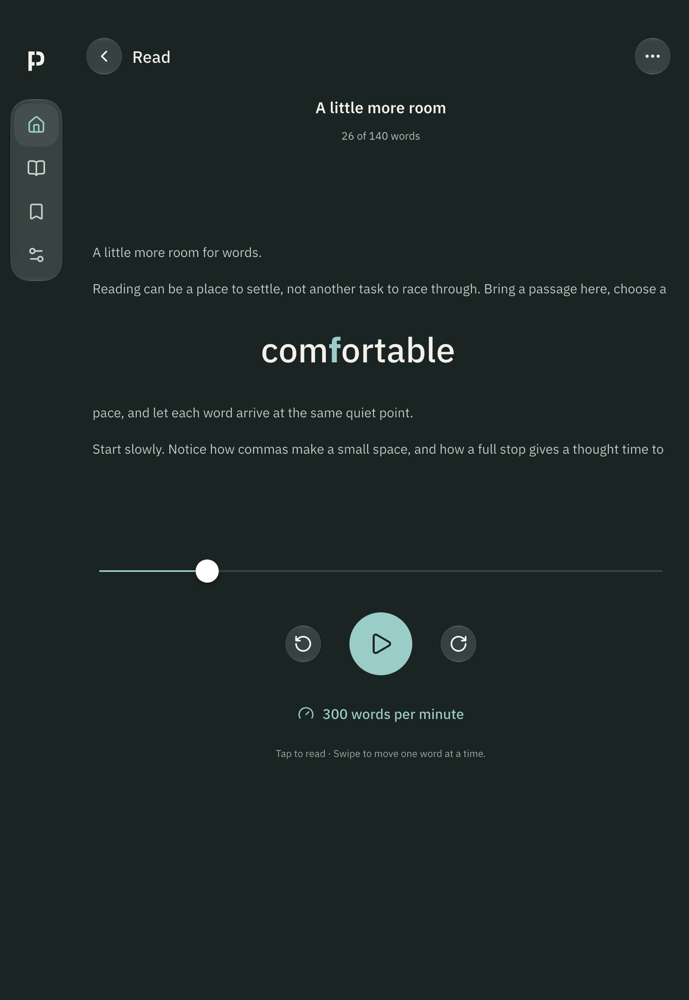
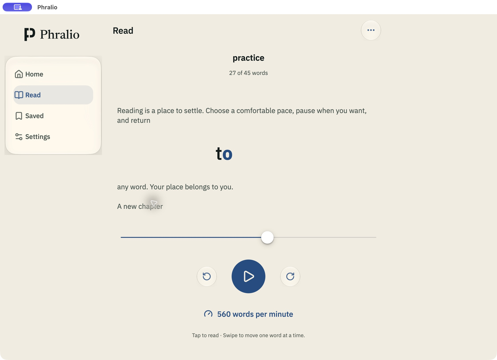
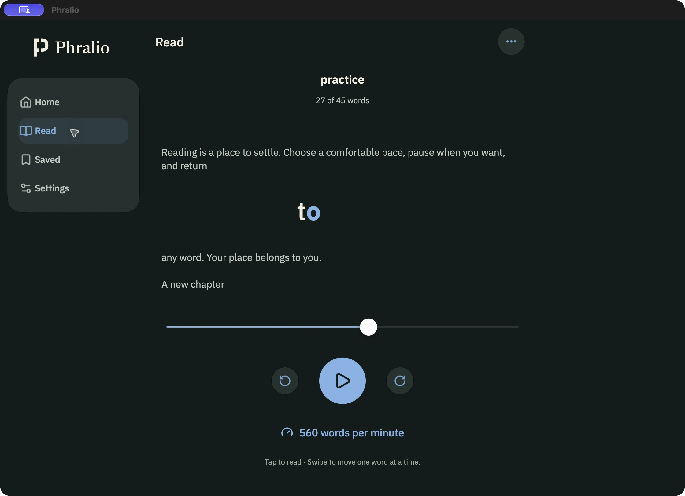
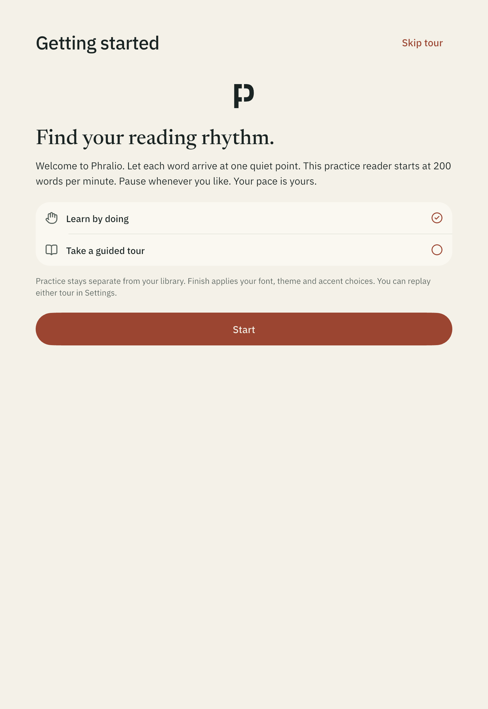
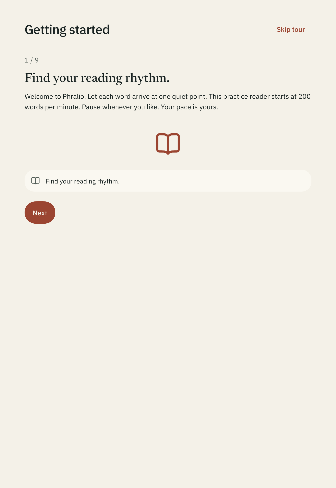
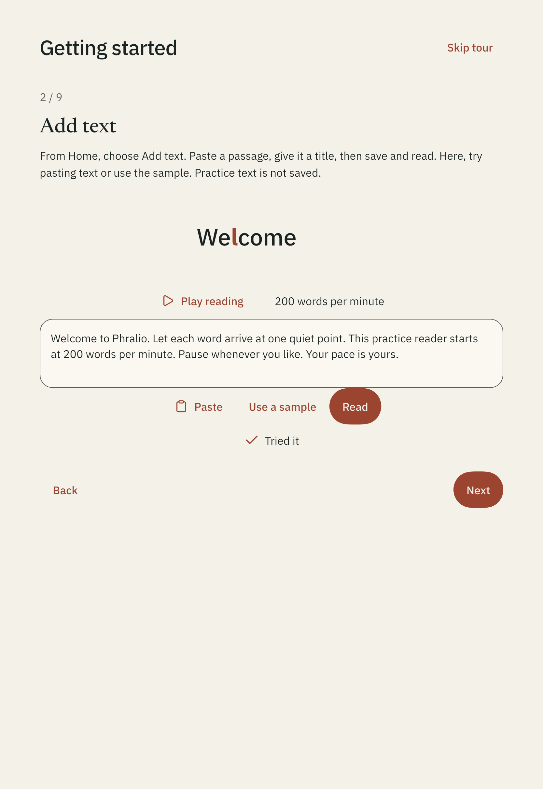

# Adaptive Phralio renders

Actual app captures using synthetic reading content, 28 September 2026.
Phone/tablet captures use Flutter's integration screenshot driver; macOS captures
use the native app window. These are unframed development renders, not store art.
The macOS title bar includes the system screen-sharing indicator from capture.

## Phone landscape





The focused reader hides navigation and progress text while keeping the thin
bar under the current word:


## Tablet portrait




## macOS




## Two onboarding options





Additional home, settings, portrait reader and onboarding PNGs are included in
this directory. The dark mobile examples use the Teal accent; macOS examples
use Blue. Light mobile examples use the default Vermilion family.

## Reproduce

```sh
flutter drive --driver=test_driver/screenshots.dart \
  --target=integration_test/adaptive_screenshots_test.dart \
  -d <device-id> --dart-define=CAPTURE_DEVICE=iphone
```

Use `CAPTURE_DEVICE=android` or `ipad` for the other filenames. The available
headless iPad runtime required `--dart-define=CAPTURE_LANDSCAPE=false`.
No iPad landscape or Android tablet device render is claimed. See the
[validation record](../../development/adaptive-platform-plan.md) for the exact
coverage and limitations.
