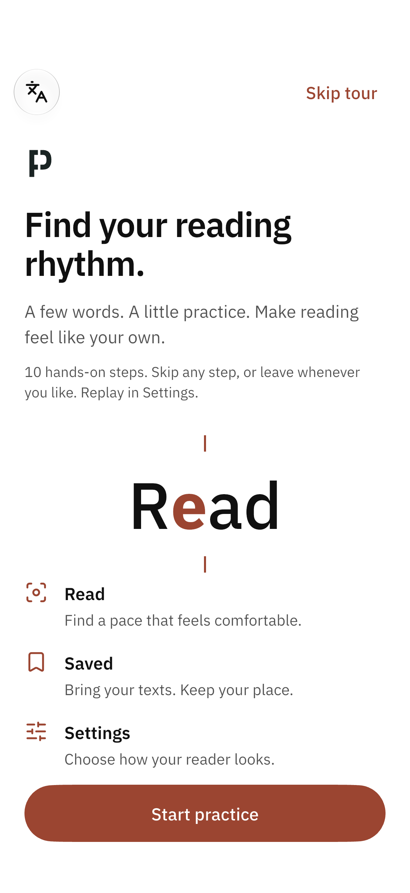
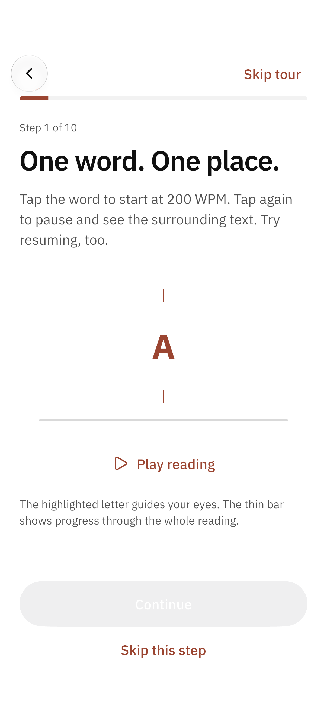
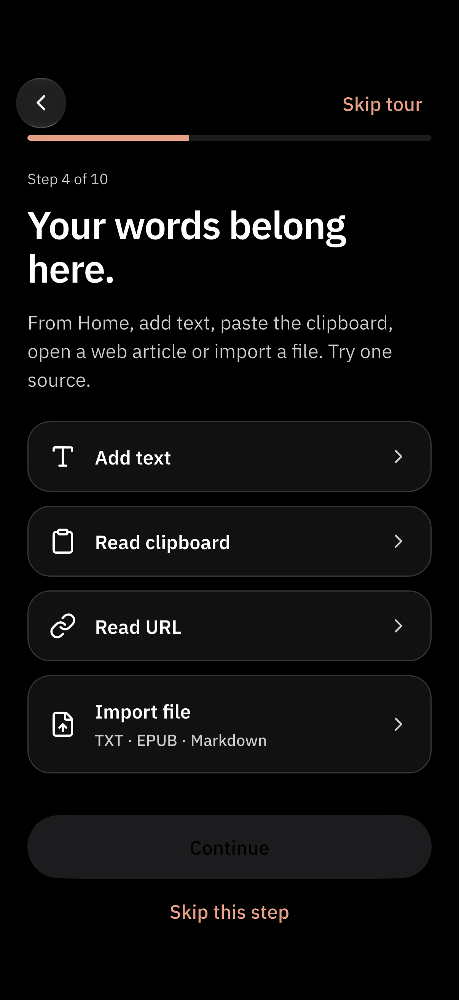
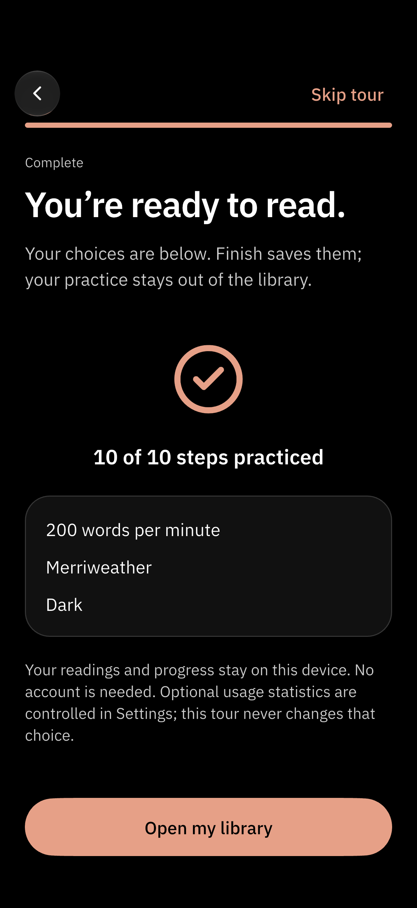
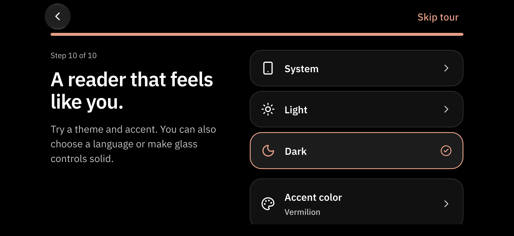
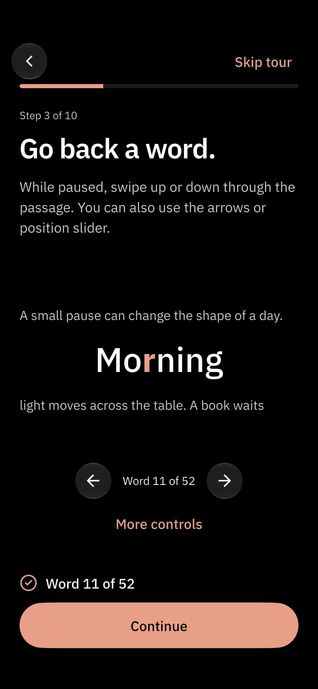
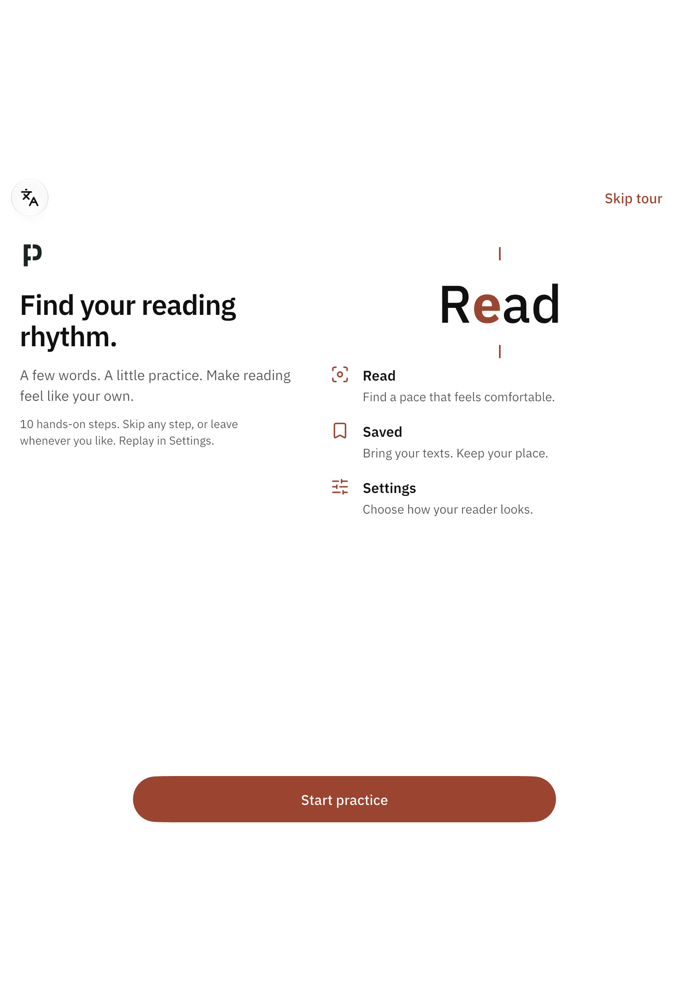

# Interactive onboarding

Real simulator captures of `features/onboarding-redesign`, 29 September 2026.
All reading content is a bundled or original practice sample. These are app
renders, not mockups. See the [screen plan](../../design/onboarding-redesign.md)
for research, individual tasks, data boundaries and the final review.

<p>
  
  
  
  
</p>

## Every lesson

| Lesson | Light | Dark |
| --- | --- | --- |
| Welcome | [View](iphone17-00-welcome-light.png) | [View](iphone17-00-welcome-dark.png) |
| Tap, play, pause | [View](iphone17-01-read-light.png) | [View](iphone17-01-read-dark.png) |
| Immersive practice | [View](iphone17-01-focus-light.png) | [View](iphone17-01-focus-dark.png) |
| Paused context | [View](iphone17-01-paused-light.png) | [View](iphone17-01-paused-dark.png) |
| Pace | [View](iphone17-02-pace-light.png) | [View](iphone17-02-pace-dark.png) |
| Word navigation | [View](iphone17-03-move-light.png) | [View](iphone17-03-move-dark.png) |
| Import sources | [View](iphone17-04-sources-light.png) | [View](iphone17-04-sources-dark.png) |
| Offline article extraction | [View](iphone17-04-web-sheet-light.png) | [View](iphone17-04-web-sheet-dark.png) |
| Contents | [View](iphone17-05-contents-light.png) | [View](iphone17-05-contents-dark.png) |
| Image duration | [View](iphone17-06-images-light.png) | [View](iphone17-06-images-dark.png) |
| Star and bookmark | [View](iphone17-07-saved-light.png) | [View](iphone17-07-saved-dark.png) |
| Saved progress | [View](iphone17-08-library-light.png) | [View](iphone17-08-library-dark.png) |
| Typography | [View](iphone17-09-type-light.png) | [View](iphone17-09-type-dark.png) |
| Ten bundled fonts | [View](iphone17-09-font-sheet-light.png) | [View](iphone17-09-font-sheet-dark.png) |
| Appearance | [View](iphone17-10-style-light.png) | [View](iphone17-10-style-dark.png) |
| Finish | [View](iphone17-11-ready-light.png) | [View](iphone17-11-ready-dark.png) |

Tall lessons scroll; the action footer remains reachable. Short landscapes and
large text move the footer into the scroll flow. Wide layouts place instructions
beside the practice. These captures show the top of each lesson, so longer
lessons can have controls below the captured viewport.



## Smaller phone and tablet

<p>
  
  
</p>

The full journey was exercised in both themes on iPhone 17, iPhone 17e and
iPad Pro 11-inch M5 simulators. Only the phones have landscape device captures;
the iPad runtime does not allow programmatic orientation changes in its current
windowing mode. Physical-device testing remains separate.

## Reproduce and try it

In the app, open **Settings → Getting started**. Replay has a Close action and
returns to Settings. It does not erase the library or existing progress. Skip
discards draft choices; Finish applies only preferences explicitly changed.

```sh
flutter drive --driver=test_driver/screenshots.dart \
  --target=integration_test/onboarding_screenshots_test.dart \
  -d <simulator-id> --dart-define=CAPTURE_DEVICE=iphone17
```

Use `CAPTURE_ALL=false` for a small representative set on another device.
`CAPTURE_LANDSCAPE=false` skips orientation requests on tablet runtimes that do
not support them. The test uses a separate disposable SQLite database and checks
that existing progress and library content survive the tour. It never resets
the user's database.

The source test includes actual tap, drag, sheet selection and preference
persistence checks. Native Back/language/Close were also clicked directly in
Device Hub after installing the normal app, because Flutter pointer injection
cannot reliably hit UIKit views.
